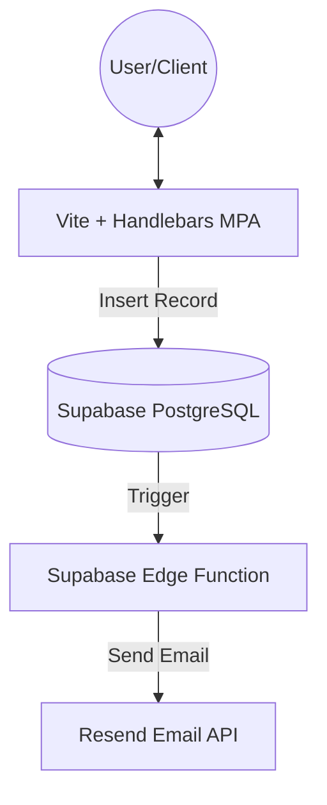

# System Blueprint: NMD Advisory

This document provides a comprehensive overview of the NMD Advisory system architecture, components, and data flows.

## System Overview
NMD Advisory is a professional services website for Accounting, Tax, IT, and Business Solutions. It functions as a high-signal lead generation engine, allowing clients to schedule consultations, send enquiries, and explore service offerings.

## Module Map
| Component | Responsibility | Location |
| :--- | :--- | :--- |
| **Frontend UI** | Multi-page static site built with Vite and Handlebars. | `/src` |
| **Client Logic** | Form handling, Supabase integration, and interactive elements. | `/src/assets/js` |
| **Database** | Persistence for bookings and enquiries. | Supabase (PostgreSQL) |
| **Edge Functions** | Backend logic (e.g., sending email notifications). | `/supabase/functions` |
| **Integrations** | External services (Resend for email). | Resend API |

## Architecture
The system follows a classic **Client-Server** architecture with a modern **Serverless** backend using Supabase.

## Runtime Flows

### 1. Lead Generation (Contact/Enquiry)
1. User fills out the contact form on `contact.html`.
2. Client-side JS (`main.js`) captures data and inserts it into the `enquiries` table in Supabase.
3. A Database Webhook triggers the `send-notification` Edge Function.
4. The Edge Function sends an email notification via Resend.

### 2. Booking Flow
1. User selects a service and time slot on `booking.html`.
2. Client-side JS (`booking.js`) inserts the booking record into the `bookings` table.
3. Similar to the enquiry flow, a webhook triggers a notification.

## Data Model
Core entities are stored in Supabase:
- **`enquiries`**: `id`, `name`, `email`, `message`, `status`, `created_at`
- **`bookings`**: `id`, `ref_code`, `name`, `email`, `service`, `booking_date`, `booking_time`, `platform`, `notes`, `created_at`

## Deployment Model
- **Frontend**: Hosted on GitHub Pages (built via `npm run deploy`).
- **Backend**: Managed by Supabase (SQL migrations and Edge Functions).
- **CI/CD**: Manual deployment currently (or via GitHub Actions if configured).

## Error Handling & Observability
- **Client**: Console logging and basic `alert()` for form errors.
- **Backend**: Supabase logs for Edge Functions and database activities.
